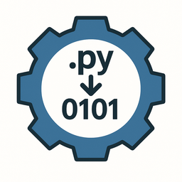

# PyAppExec

<div align="center">
  
</div>

PyAppExec is a cross-platform bootstrapper that prepares a Python application for end users. It locates (or installs) a suitable Python interpreter, provisions an isolated virtual environment, downloads any third-party tooling you bundle, installs Python dependencies, and finally launches your target script - all driven by a simple `.ini` file specification.

- [Overview](#overview)
- [Key Features](#key-features)
- [How It Works](#how-it-works)
- [Repository Layout](#repository-layout)
- [Getting Started](#getting-started)
  - [Prerequisites](#prerequisites)
  - [Build](#build)
  - [Run](#run)
- [Configuration](#configuration)
  - [Main section](#main-section)
  - [Requirements section](#requirements-section)
  - [Example](#example)
- [Bundling External Artifacts](#bundling-external-artifacts)
- [Sample Application](#sample-application)
- [Development Notes](#development-notes)
- [Troubleshooting](#troubleshooting)
- [Contributing](#contributing)
- [License](#license)
- [Acknowledgements](#acknowledgements)

## Overview

Many Python applications require users to install Python, set up virtual environments, download extra outside dependencies, and install Python packages before they can run the app. PyAppExec automates those steps so you can distribute a native binary launcher alongside your Python project. Ship the PyAppExec binary, ship an `.ini` configuration that describes what the launcher should do, and PyAppExec takes care of the rest.

While PyInstaller, cx_Freeze and similar tools are excellent when you need a completely self-contained binary, PyAppExec deliberately lightens the shipped package, relegating the heavier dependency downloads to the end user’s machine during the first run. Unlike these “freezer” tools that bundle an entire Python runtime and all dependencies into a monolithic executable, PyAppExec keeps your Python project intact and simply orchestrates interpreter provisioning, virtual environments, and external tooling on the user’s machine. That makes updates faster (swap out your Python sources without rebuilding a frozen binary), reduces download size, and keeps the runtime transparent for power users who still want to inspect or modify the Python code.

## Key Features

- Detects the highest priority Python interpreter on the PATH and validates its version.
- Allows per-platform `.ini` sections so Windows, macOS, and Linux can point at platform-specific scripts, download URLs, and tooling.
- On Linux, optionally installs Python via `apt`, `dnf`, or `pacman` if a suitable interpreter is not found.
- Creates or reuses a per-project virtual environment and keeps a lightweight state file to avoid redundant `pip install` runs.
- Installs Python package dependencies from a configurable requirements file inside the virtual environment.
- Downloads and, when possible, installs external tools, using integrity checks to avoid re-downloading unchanged files.
- Launches the target Python entry point after the environment is ready, with stdout/stderr feedback in the terminal.
- Accepts optional command-line arguments and environment overrides from the `.ini`.
- Ships with an optional Qt6 front-end that surfaces progress, embedded terminal output, and error dialogs.
- Emits structured logs via `spdlog` so you can tail progress or integrate with external log collectors.
- Embeds helper Python scripts via GLib resources so the launcher has zero runtime script dependencies.

## How It Works

1. PyAppExec reads `pyappexec.ini` and selects the `[<OS>:main]` and `[<OS>:requirements]` sections that match the current platform (`Linux`, `MacOS`, `Windows`).
2. It resolves relative paths against the directory that contains the `.ini` file.
3. If no suitable Python interpreter is found, PyAppExec can attempt an installation via common package managers (on Linux) or fall back to the configured download URL so you can prompt users to install it manually.
4. A virtual environment is created (or reused) at the configured location.
5. Python dependencies from `requirements.txt` (or whichever file you point to) are installed inside that environment. A signature file prevents redundant installs when the requirements file has not changed.
6. For each external requirement defined in the `.ini` file, PyAppExec checks whether it is already present and satisfies the minimum version. Missing dependencies are downloaded to the `distrib/` directory or installed via a custom command.
7. Finally, the target Python script is invoked using the virtual environment's interpreter.

## Repository Layout

```
.
├── CMakeLists.txt          # CMake build configuration for the C++ launcher
├── main.cpp                # Entry point that drives the CLI/GUI bootstrapper
├── include/                # Public headers shared between the CLI and GUI layers
├── lib/                    # Core launcher implementation (AppBootstrapper, utils, etc.)
├── gui/                    # Qt6 widgets for the optional front-end (MainWindow, GuiRunner)
├── resources/              # GLib resource manifest plus embedded Python helper scripts
├── scripts/                # Source copies of the embedded helper scripts
├── LICENSE / README.md     # Project metadata and documentation
```

## Getting Started

### Prerequisites

To build the launcher you need:

- A C++20 toolchain (GCC 11+, Clang 13+, or MSVC 19.30+).
- CMake 3.16 or newer.
- `pkg-config` and the development headers for `gio-2.0` (part of GLib) — these provide `glib-compile-resources` and the GIO runtime used to embed scripts. On macOS install them with `brew install glib libffi zlib`.
- Qt 6 (Widgets module) headers and libraries for the optional GUI front-end.
- [spdlog](https://github.com/gabime/spdlog) (header-only logging library) for structured logging output.
- Boost (Boost.Process header is required; the default compiled Boost libraries are optional on most platforms).
- `curl` (Linux/macOS) or the Windows URLMon APIs (already part of Win32) for downloading requirement archives.

### Build

```bash
cmake -S . -B build -DCMAKE_BUILD_TYPE=Release
cmake --build build
```

The build step generates `resources.c` from `resources/resources.xml` using `glib-compile-resources`. Ensure that tool is discoverable on your `PATH`.

> **macOS workflow:** Install the dependencies via `brew install glib libffi zlib boost qt spdlog` (Boost supplies `<boost/process.hpp>` and Qt6 supplies the GUI). Homebrew's `pkg-config` should expose `gio-2.0` after those installs; if it does not, export `PKG_CONFIG_PATH="/opt/homebrew/opt/libffi/lib/pkgconfig:/opt/homebrew/lib/pkgconfig:/opt/homebrew/share/pkgconfig:$PKG_CONFIG_PATH"` (adjust the prefixes if needed) and rerun `pkg-config --modversion gio-2.0` to confirm it resolves to the Homebrew install. You can run `scripts/build_macos.sh` to apply the environment tweaks automatically and execute `cmake -S … && cmake --build …` in one step.

### Run

After building, run the launcher from the project root:

```bash
./build/pyappexec
```

PyAppExec first looks for `pyappexec.ini` in the current directory; if it is not found, it scans each immediate subdirectory (this is how the sample config in `test2/pyappexec.ini` is discovered). To point at a specific file explicitly, pass `--config /path/to/pyappexec.ini`.

**Useful flags**

- `--config /path/to/pyappexec.ini` – override the config discovery logic described above.
- `--no-gui` – force CLI mode even when the INI requests the Qt front-end.
- `--reset-gui` – clear the persisted "hide GUI" preference (handy if you previously suppressed the GUI after a successful run).
- `--help` – print a brief overview of PyAppExec and the available flags.

### Quick start (bundling your Python app)

1. Copy your built `pyappexec` binary and a tailored `pyappexec.ini` into the root of the Python application you plan to ship (the repo’s `test2/pyappexec.ini` shows the recommended layout where every path is relative to the INI). Rename the binary to match your product if you like.
2. Run the launcher once from that directory to ensure the virtual environment, `distrib/` downloads, and GUI suppression preference behave as expected. Remove any temporary `distrib/` artifacts you don’t plan to prebundle.
3. Include a short README/release note in your distribution that states the app is bootstrapped by PyAppExec and links to https://github.com/quicknode-labs/PyAppExec for attribution and support.

### GUI mode

Set `GUI = true` under the relevant `[<OS>:main]` section to launch the Qt6 front-end. The GUI embeds the CLI output (PowerShell on Windows, Terminal on macOS/Linux), shows a progress indicator, and surfaces blocking error dialogs if anything fails. The window title automatically displays your Python app name followed by “(via PyAppExec)” so end users can immediately see that PyAppExec is handling the bootstrap. When a run completes successfully you can check “Hide GUI after successful runs” before closing the window; PyAppExec remembers that preference (per app) and skips the GUI going forward, automatically re-enabling it if a later run fails. The Help menu also exposes “About PyAppExec” and “About Qt” dialogs for attribution. Pass `--no-gui` on the command line or set `GUI = false` to force the traditional CLI experience even when the INI enables the GUI. Use `--config /path/to/pyappexec.ini` to point the launcher at a specific configuration file, and `--reset-gui` to clear any saved GUI suppression preference.

## Configuration

PyAppExec is driven entirely by `pyappexec.ini`. Each operating system gets its own pair of sections: `[Linux:main]` and `[Linux:requirements]`, `[Windows:main]` and `[Windows:requirements]`, and so on. Keep the INI alongside your Python application (like the sample `test2/pyappexec.ini`) so relative paths resolve naturally; PyAppExec automatically discovers it when launched from the project root.

### Main section

| Key | Required | Description |
| --- | --- | --- |
| `python_download_url` | no | URL you can surface to users if you need to link to an installer. The launcher does not download Python automatically from this URL but exposes it for logging and UX hooks. |
| `python_min_ver` | yes | Minimum acceptable Python version (for example `3.10`). |
| `python_app_dir` | no | Directory that contains your Python project. Defaults to the INI file's directory. |
| `exec_app_path` | yes | Entry-point script relative to `python_app_dir`, usually your `main.py`. |
| `exec_app_args` | no | Extra command-line arguments appended after the entry script. Quote values with spaces (`"--flag value"`). |
| `exec_env` | no | Semicolon-separated list of `KEY=VALUE` pairs that override environment variables for the launched app. |
| `requirements_file` | no | Relative path to the Python requirements file. If omitted, Python dependency installation is skipped. |
| `virtual_env_dir` | no | Directory to create the virtual environment in (relative to `python_app_dir`). Defaults to `.venv`. |
| `GUI` | no | `true` to launch the Qt front-end; `false` to stay purely CLI. Users can also pass `--no-gui` at runtime to force CLI regardless of config. |
| `log_console` | no | `true` (default) to emit logs to stdout/stderr, `false` to silence console output (the GUI still captures logs internally). |
| `log_level` | no | Minimum severity for console logs. Supports `trace`, `debug`, `info`, `warn`, `error`, `critical`, `off`. |

Example: `exec_env = APP_ENV=production;LOG_LEVEL="info"` injects two variables, while `exec_app_args = --profile default --no-telemetry` adds both flags after the entry script.

### Requirements section

Define any number of `requirement_<n>` blocks (numbered sequentially from 1). Each block supports:

| Key | Description |
| --- | --- |
| `requirement_<n>` | Human-friendly name, e.g. `FFmpeg`. |
| `requirement_<n>_url` | Download URL for an installer or archive. The file is stored under `distrib/`. |
| `requirement_<n>_file_name` | Override for the downloaded filename. Defaults to the basename of the URL. |
| `requirement_<n>_version_check_command` | Command used to detect the installed version, such as `ffmpeg -version`. |
| `requirement_<n>_version_regex` | Regular expression with a capture group that extracts the version number. |
| `requirement_<n>_min_version` | Minimum acceptable version; omit to accept any detected version. |
| `requirement_<n>_launch_file` | Name of the executable you expect after extraction (used primarily for logging). |
| `requirement_<n>_capture_stderr` | When `true`, merges stderr into stdout during version detection. |
| `requirement_<n>_cmd_params` | Extra parameters appended when running a Windows installer executable. |
| `requirement_<n>_install_command` | Shell command to run for installing the requirement (Linux/macOS). If provided, PyAppExec skips downloading and executes this command directly. |

PyAppExec keeps per-requirement status in memory to avoid noisy logs when the version check command is run multiple times.

### Example

The repository ships with a Linux configuration that targets the sample app in `test/`:

```ini
[Linux:main]
python_download_url = https://www.python.org/ftp/python/3.13.1/Python-3.13.1.tgz
python_min_ver = 3.10
python_app_dir = test
exec_app_path = src/your_package/__main__.py
requirements_file = requirements.txt
virtual_env_dir = .pyappexec-venv
GUI = true
log_console = true
log_level = info
; exec_app_args = --profile default
; exec_env = APP_ENV=production

[Linux:requirements]
requirement_1 = FFmpeg
requirement_1_url = https://johnvansickle.com/ffmpeg/releases/ffmpeg-release-amd64-static.tar.xz
requirement_1_file_name = ffmpeg-release-amd64-static.tar.xz
requirement_1_version_check_command = ffmpeg -version
requirement_1_version_regex = ^ffmpeg version ([0-9.]+)
requirement_1_min_version = 4.4.2
requirement_1_launch_file = ffmpeg
requirement_1_capture_stderr = false
requirement_1_install_command = sudo apt-get update && sudo apt-get install -y ffmpeg

[Windows:main]
python_download_url = https://www.python.org/ftp/python/3.13.1/python-3.13.1-amd64.exe
python_min_ver = 3.10
python_app_dir = test
exec_app_path = src/your_package/__main__.py
requirements_file = requirements.txt
virtual_env_dir = .pyappexec-venv
GUI = true
log_console = true
log_level = info

[Windows:requirements]
requirement_1 = FFmpeg
requirement_1_url = https://www.gyan.dev/ffmpeg/builds/ffmpeg-release-essentials.7z
requirement_1_file_name = ffmpeg-release-essentials.7z
requirement_1_version_check_command = ffmpeg -version
requirement_1_version_regex = ^ffmpeg version ([0-9.]+)
requirement_1_min_version = 7.0
requirement_1_capture_stderr = false
requirement_1_cmd_params = /S /quiet
```

On Windows, optional `cmd_params` can be supplied to run silent installers.

A macOS profile follows the same pattern with `[MacOS:main]` and `[MacOS:requirements]` sections; the sample `test2/pyappexec.ini` shows how to point those entries at the same application while using a platform-appropriate Python installer URL and Homebrew-based FFmpeg installation command.

### Working with `pyproject.toml`, Poetry, Pipenv, uv, etc.

PyAppExec installs dependencies by running `pip install -r <requirements_file>` inside the managed virtual environment. Projects that rely on `pyproject.toml`-only builds or external tooling can still be launched with a few extra steps:

- **Export a lock file**: most tools can emit a plain requirements file that PyAppExec can consume (`poetry export --without-hashes --format requirements.txt > requirements.txt`, `pipenv lock -r > requirements.txt`, `uv pip compile pyproject.toml -o requirements.txt`). Point `requirements_file` at the exported artifact and refresh it whenever dependencies change.
- **Delegate to your tool**: instead of (or in addition to) `requirements_file`, set `exec_app_args` or wrap your entry point so the launcher runs `poetry run …`, `pipenv run …`, `uv run …`, etc. You can vendor the tool inside your project and install it via `requirements.txt` if needed.
- **Custom bootstrap scripts**: complex setups (building optional wheels, applying migrations, downloading models) can be orchestrated by pointing `exec_app_path` at a bespoke `bootstrap.py` that shells out to Poetry/Pipenv/uv as required before launching your real app.

Regardless of approach, remember that PyAppExec always executes inside its own virtual environment. If your tool manages environments internally (for example `pipenv --venv`), either disable the virtual env in `pyappexec.ini` (point `virtual_env_dir` to a location you control and skip creating it) or ensure the tool is happy with the interpreter PyAppExec provisions.

## Bundling External Artifacts

Place offline installers, archives, or wheel files in the `distrib/` directory. PyAppExec stores downloads here and skips re-downloading when the file already exists with the expected size (checked via HTTP `Content-Length`). You can pre-populate this directory before shipping your package to avoid runtime downloads.

## Sample Application

The `test/` directory contains the open-source YT Channel Downloader project as an integration example. To try the full flow:

1. Build PyAppExec.
2. Ensure `ffmpeg` is installed or let the Linux configuration install it for you.
3. Run `./build/pyappexec` from the repository root. The launcher will set up a virtual environment under `test/.pyappexec-venv`, install Python dependencies from `test/requirements.txt`, and start the PyQt application defined in `test/main.py`.

You can swap out the `test2/` directory with your own Python app by updating `pyappexec.ini`.

## Read the Docs site

All content from this README plus additional deep dives is mirrored under `readthedocs/` so it can be published on [Read the Docs](https://readthedocs.com/). To preview the site locally:

```bash
python -m venv .docs-venv
source .docs-venv/bin/activate
pip install sphinx sphinx-rtd-theme
(cd readthedocs && sphinx-build -b html . _build/html)
```

Open `_build/html/index.html` in your browser to inspect the generated documentation.

## Development Notes

- The launcher automatically embeds `scripts/get_python_version.py` using GLib resources; edit `resources/resources.xml` if you need to ship additional helper scripts.
- A build generates `.pyappexec_requirements_state` under the virtual environment directory to cache the requirements signature. Delete it if you need to force a reinstall.
- CMake now emits `compile_commands.json` in your build directory (thanks to `CMAKE_EXPORT_COMPILE_COMMANDS=ON`). Point Codacy/Cppcheck at that file (or copy it to the repo root) so they analyze the real translation units instead of header-only snapshots.
- Boost.Process powers all child process execution. Ensure the runtime has permission to spawn subprocesses and access network resources.

## Testing

Lightweight smoke tests validate the INI layout, Read the Docs structure, and GUI build configuration. Run them with:

```bash
python tests/run_all.py
```

The test scripts live under `tests/` and can be extended as the project grows.

## Troubleshooting

- **Python not detected**: Confirm that a compatible interpreter is available on the `PATH`. On Linux, check the console logs to see if PyAppExec attempted package-manager installation.
- **`glib-compile-resources` missing**: Install the GLib development tools package (`libglib2.0-dev-bin` on Debian/Ubuntu, `glib2` on Arch, `brew install glib` on macOS).
- **External requirement download fails**: Verify the URL, ensure HTTPS certificates are trusted, and check that the host is reachable in your deployment environment.
- **Virtual environment issues**: Remove the existing virtual environment directory (for example `test/.pyappexec-venv`) and rerun the launcher to force a clean setup.

## Contributing

Issues and pull requests are welcome. Please include reproduction steps and platform details when reporting bugs. If you plan to contribute substantial changes, open a discussion first so we can align on direction.

## License

This project is released under the [MIT License](LICENSE).

## Acknowledgements

- [Boost.Process](https://www.boost.org/doc/libs/release/doc/html/process.html) for portable child process management.
- [GLib/GIO](https://docs.gtk.org/gio/) for resource embedding.
- The [YT Channel Downloader](https://github.com/hyperfield/yt-channel-downloader) project for the sample Python application included under `test/`.
